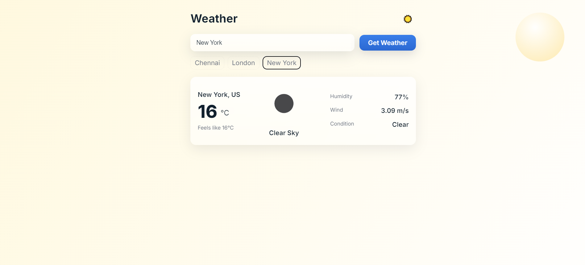
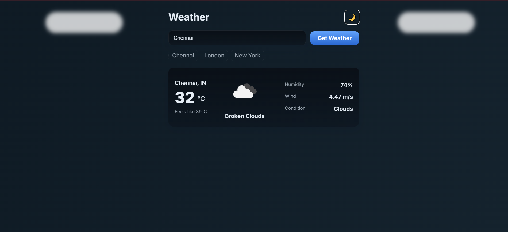

# 🌦️ Weather Card – React + OpenWeather API

A simple yet polished weather application built with **React.js**.  
It fetches real-time weather data from the **OpenWeather API** and displays it in a neat, responsive weather card.  
I made this as part of my **ACM Club mini-project** while learning React. 

---

## ✨ Features
- 🔍 Search for any city’s current weather  
- 📍 Quick-select chips (Chennai, London, New York)  
- 🌡️ Shows temperature, feels like, humidity, wind, and condition  
- 🎨 Clean modern UI with light/dark modes  
- 🌈 Animated gradient backgrounds that adapt to weather (rain, snow, sunny, mist, thunder)  

---

## 📸 Screenshots
### Light Mode  


### Dark Mode  


---

## ⚙️ Getting Started

Follow these steps to run the project locally:

### 1. Clone the repo

```bash
git clone https://github.com/FalconAI007/Weather-Card.git
cd weather-card
```

### 2. Install dependencies

Make sure [Node.js](https://nodejs.org/) is installed.  
Then install packages:

```bash
npm install
```

### 3. Set up API key

Sign up at [OpenWeather](https://openweathermap.org/api) and get your API key.  
Create a file named **`.env`** in the project root:

```env
REACT_APP_OPENWEATHER_KEY=your_api_key_here
```


### 4. Start the app

```bash
npm run dev
```

The app will open at [http://localhost:3000](http://localhost:3000).

---

## 🚀 Deployment

You can easily deploy this project using:

- [Vercel](https://vercel.com/)  
- [Netlify](https://www.netlify.com/)  

Both work great with React and auto-deploy from GitHub.

---

## 🛠️ Built With

- [React.js](https://react.dev/) – frontend library  
- [OpenWeather API](https://openweathermap.org/api) – weather data  
- [CSS3](https://developer.mozilla.org/en-US/docs/Web/CSS) – animations, gradients, responsive design  

---
